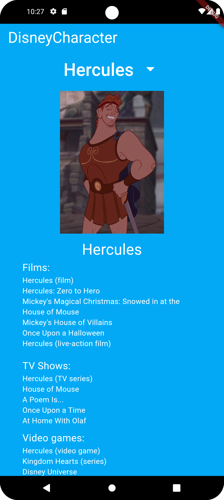

# Flutter
In this folder there are some apps I created that showcase my skills using Flutter. 
1. [Go_Moon:](go_moon) Little app showing how widgets work
    

3. [Taskly:](taskly) App about saving task to do them later.
     

5. [Disney Char App:](disneycharapp) App to show how to use API Rest in Flutter
     

7. [Frivia:](friviaa) App which recibes info from API and use it to play trivial.
     

9. [Animdo App:](animdo) App to show how to use animations in Flutter.
      

11. [Finstagram:](finstagram) App similar to Instagram which uses Firebase to save pictures and authentication.
      
  

13. [IBMI:](ibmi) App using Cupertino Widgets to make the UI more similar to IOs UI. Also, it has unit testing and dependency testing.
      

This app were created following Hussain Mustafa's Complete Flutter Development Course.
